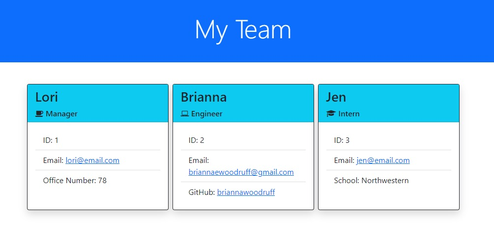

  # Team Profile Generator
  

  ## Description:
  The motivation behind this project was to create an application that generates an HTML webpage that displays information about members in a team.     This is a command-line application where the user is prompted by the Inquirer npm package. The user inputs information about each team member and is asked questions based on their role to generate the HTML page. It is initiated by running NodeJS and was tested with the Jest npm package.     For future development of this project, I would like to add a GitHub API call to confirm that the username inputted is a profile.
   

  ## Table of Contents:
  * [Installation](#installation)
  * [Usage](#usage)
  * [License](#license)
  * [Contributing](#contributing)
  * [Tests](#tests)
  * [Questions](#questions)

  ## Installation:
  To install this application, confirm NodeJS is installed on your computer and `git clone` this repository. Run `npm i` in your command-line to install required dependencies in this directory.
   
  
  ## Usage:
        To use this application, run `node index.js` in the command-line. You will be prompted with a series of questions that will be inputted in the HTML page. After all the questions are answered, a index.html file will be created in the dist/ folder.      
   

  ## License: 
  
   
  Licensed under MIT License.
   

  ## Contributing:
  To contribute to this project, contact me at 
  briannaewoodruff@gmail.com or visit my GitHub [briannawoodruff](https://github.com/briannawoodruff).
   

  ## Tests:
  This application is tested with the Jest npm package. After the dependencies are installed with `npm i`, run `npm test` in the command-line to view the passing tests.
   
  
  ## Questions:
  If you have any questions, you can contact me at briannaewoodruff@gmail.com or visit my GitHub [briannawoodruff](https://github.com/briannawoodruff).
  